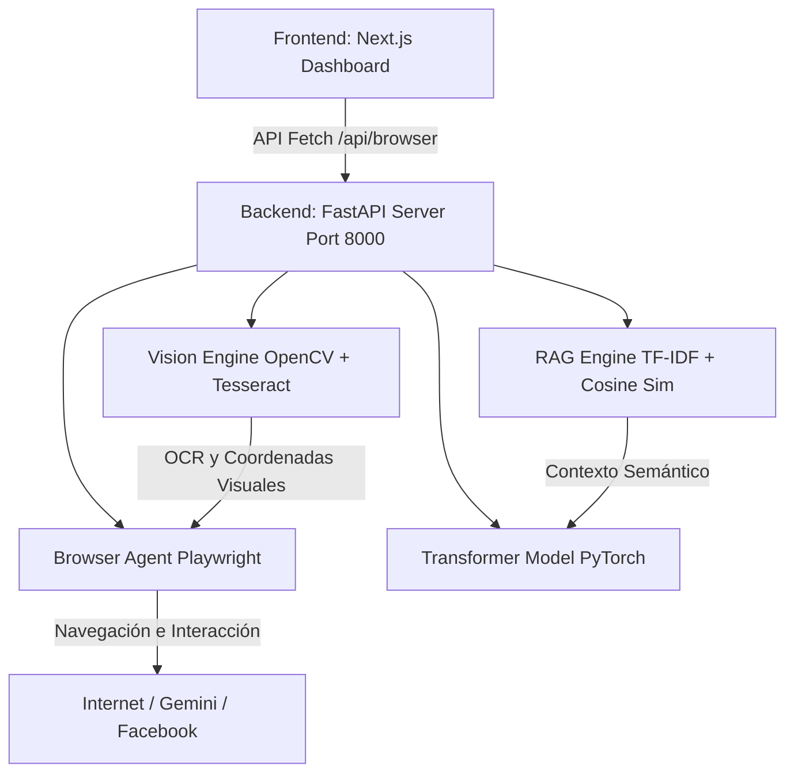

# 🌌 XuperBrain — Documentación Oficial y Arquitectura

Bienvenido a la documentación técnica de **XuperBrain v3.0**, la inteligencia artificial autónoma integrada directamente en la plataforma **Local Ecomer**. 

Este documento explica de forma detallada qué hace esta IA y cómo está construida tanto en su lógica de backend como en su automatización e interfaz de usuario.

---

## 🎯 ¿Qué hace XuperBrain?

XuperBrain no es un simple bot de respuestas estructuradas; es un **agente de razonamiento autónomo y automatización visual** capaz de interactuar con el sistema operativo y con internet de la misma forma que lo haría un humano.

### 1. Misiones Autónomas de Navegación (Web Agent)
* **Logins Inteligentes:** Puede iniciar sesión en plataformas complejas (Gmail, GitHub, Facebook) interpretando el flujo de formularios, evadiendo confirmaciones de seguridad y resolviendo problemas de redirección de manera dinámica.
* **Flujos de Generación y Publicación:** Es capaz de encadenar tareas multinivel (similares a automatizaciones de n8n): entra a Gemini/ChatGPT, le ordena generar una imagen con un prompt en lenguaje natural, descarga la imagen, valida su existencia local y la publica en el muro de Facebook con copies y tags virales.
* **Automatización de Mensajería:** Abre WhatsApp Web, busca contactos específicos, redacta mensajes y adjunta archivos multimedia de forma directa.

### 2. Visión Artificial Local y OCR (VisionEngine)
* **Reconocimiento de Pantalla:** Toma capturas de pantalla del navegador en tiempo real y usa algoritmos de visión artificial para identificar botones y textos.
* **Omitir Anuncios y Popups:** Reconoce palabras clave visuales como *"Saltar anuncio"*, *"Omitir"*, *"Skip Ad"*, o la típica cruz de cierre (`X`), localizando sus coordenadas físicas (X, Y) y simulando clics del mouse para limpiarlos.
* **Segmentación de Captchas:** Divide áreas de pantalla en cuadrículas (grids) para interactuar con elementos específicos de captchas y menús.

### 3. Motor RAG (Retrieval-Augmented Generation) Local
* **Ingestión Semántica:** Lee y aprende de textos directos, archivos locales (`.txt`, `.md`, `.py`) y páginas web completas (URLs).
* **Chunking y Vectorización:** Divide los textos en fragmentos de ~300 palabras con solapamiento y los vectoriza mediante un motor **TF-IDF** construido 100% desde cero en Python sin depender de servicios de nube como Pinecone o ChromaDB.
* **Búsqueda Semántica:** Ante una consulta del usuario, calcula la similitud coseno entre los vectores para encontrar los fragmentos más relevantes e inyectarlos en el contexto del modelo.

### 4. Modelo Transformer Local
* **Tokenizador BPE:** Entrena un tokenizador de codificación de pares de bytes (BPE) sobre el corpus ingerido para mapear palabras a IDs numéricos de forma óptima.
* **Red Neuronal Transformer:** Cuenta con una arquitectura de Transformer local implementada en PyTorch (capas de atención multinivel, feed-forward y embeddings posicionales) para la generación de texto contextualizado a partir de la base de conocimientos RAG.

---

## 🏗️ ¿Cómo está construida? (Arquitectura Técnica)

XuperBrain se divide en dos grandes componentes integrados: un **Backend en Python** para el razonamiento y la navegación pesada, y un **Frontend en Next.js** para el control del usuario.

### 1. El Backend de Python (`/backend`)
Construido de manera ligera y rápida sobre **FastAPI** y estructurado con los siguientes módulos de software:

* **[server.py](file:///home/jerson/Documentos/local-ecomer/backend/server.py):** El servidor principal. Expone endpoints de API para interactuar con el agente (`/api/browser`), ingestión de datos RAG, entrenamiento del modelo e información de telemetría de CPU/RAM del sistema.
* **[browser_agent.py](file:///home/jerson/Documentos/local-ecomer/backend/browser_agent.py):** Utiliza **Playwright** para controlar una instancia persistente de Chromium. Guarda cookies, perfiles e inicios de sesión en disco (`~/chrome_profile`) para evitar verificaciones repetitivas de seguridad.
* **[vision_engine.py](file:///home/jerson/Documentos/local-ecomer/backend/xuper_brain/vision_engine.py):** El ojo de la IA. Integra **OpenCV** para procesamiento de imágenes y **PyTesseract** para reconocimiento óptico de caracteres (OCR) local.
* **[knowledge/rag_engine.py](file:///home/jerson/Documentos/local-ecomer/backend/xuper_brain/knowledge/rag_engine.py):** Motor de base de datos vectorial local. Estructura el indexado de documentos y búsquedas utilizando operaciones matemáticas de matrices en **NumPy**.
* **[training/pipeline.py](file:///home/jerson/Documentos/local-ecomer/backend/xuper_brain/training/pipeline.py) y [model/transformer.py](file:///home/jerson/Documentos/local-ecomer/backend/xuper_brain/model/transformer.py):** Módulos que implementan y entrenan el modelo de lenguaje basado en redes neuronales Transformer de PyTorch.

### 2. El Frontend de Next.js (`/app` y `/components`)
Una interfaz moderna construida sobre **React, TypeScript y Tailwind CSS**:

* **[AIMissionSection.tsx](file:///home/jerson/Documentos/local-ecomer/components/features/dashboard/management/AIMissionSection.tsx):** Panel de control interactivo de misiones. 
  - Permite configurar credenciales locales de Gmail y Facebook.
  - Ofrece una terminal interactiva que muestra el log de progreso del navegador Playwright paso a paso en tiempo real.
  - Muestra screenshots del navegador para que puedas ver lo que la IA "está viendo" en vivo mientras navega.
* **[page.tsx](file:///home/jerson/Documentos/local-ecomer/app/dashboard/page.tsx):** Integra el panel de misiones dentro del sidebar bajo el menú **"Sistema Avanzado"**.

---

## 🔒 Seguridad y Privacidad Local
Una de las mayores ventajas de la arquitectura de XuperBrain es que **es 100% soberana y privada**:
* Las credenciales que configuras en la sección "Misión de IA" se guardan de forma cifrada únicamente en el almacenamiento local de tu navegador (`localStorage`) y en el disco de tu computadora.
* No se envían credenciales ni contraseñas a servidores en la nube externos.
* La visión artificial, el OCR y el indexado RAG se ejecutan localmente en el procesador de tu computadora.
